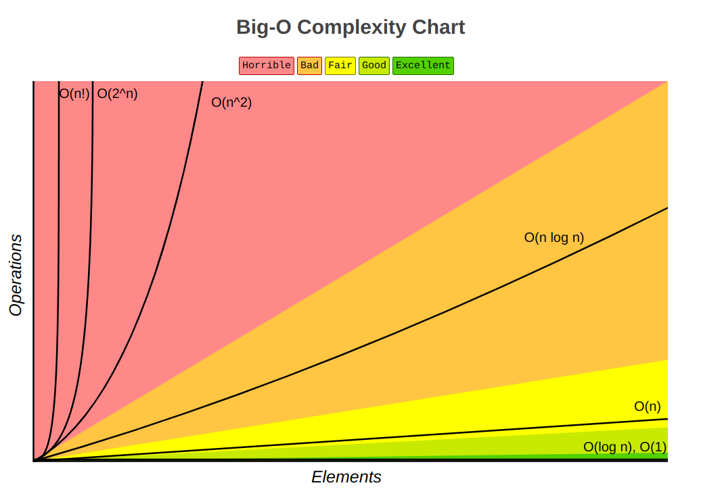
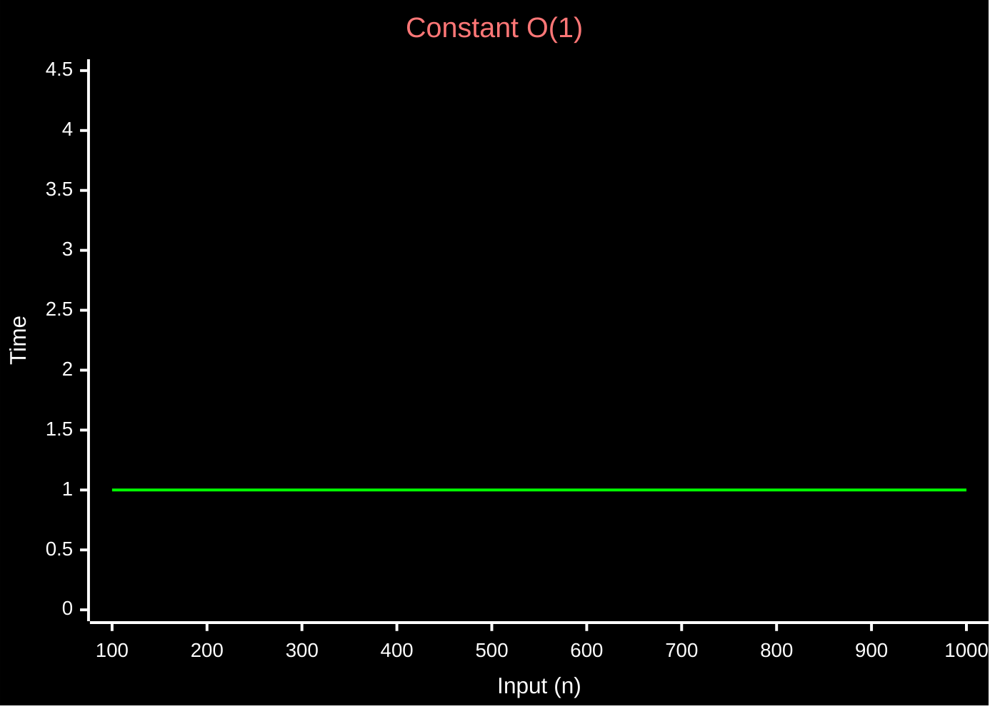
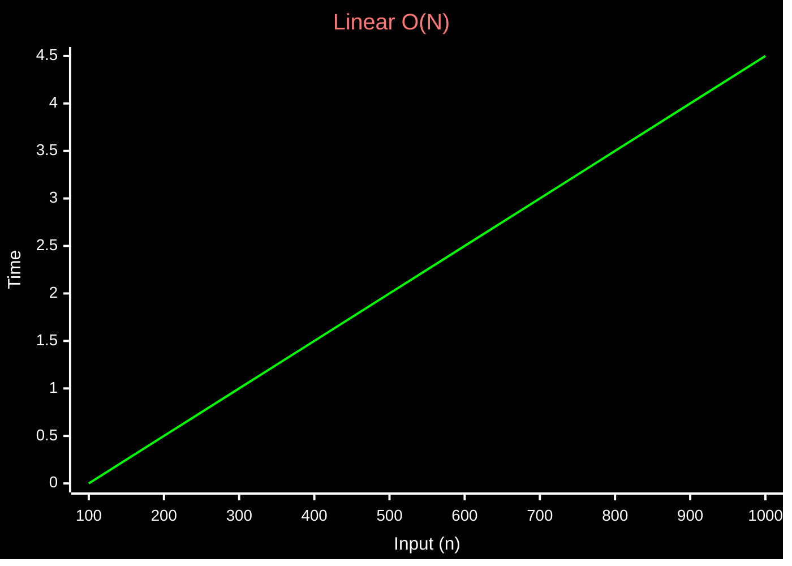
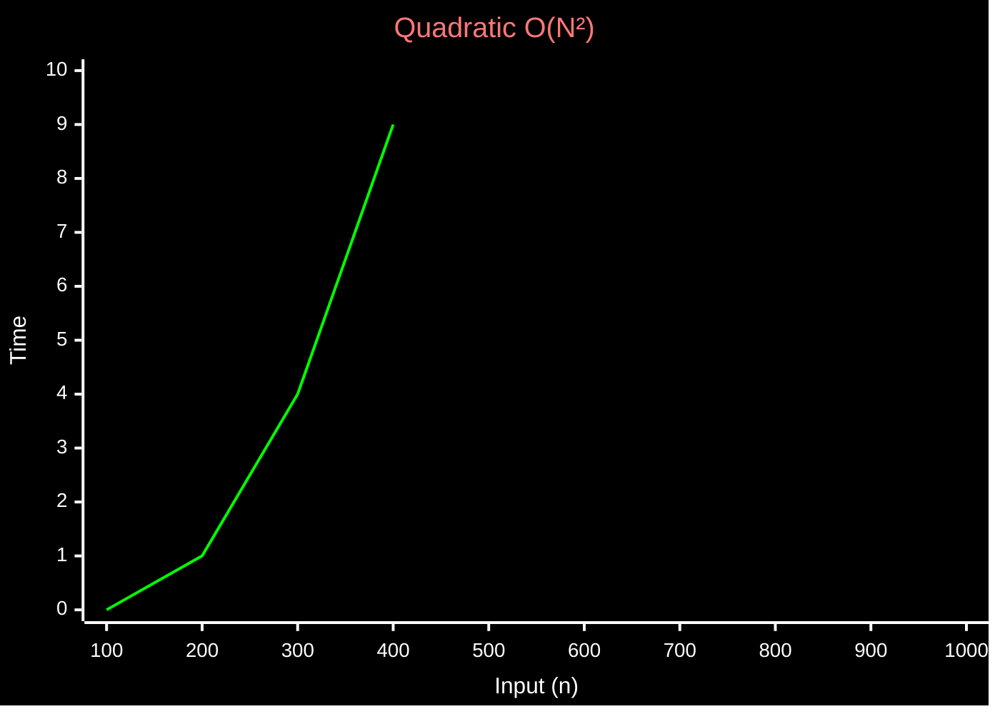

Algorithmic complexity
time complexity and space complexity

#Note 
Time complexity is a way to analyze an algorithm's efficiency by measuring how the number of operations grows as the input size grows (n).

or you can say it is a measure of how the runtime of an algorithm grows as the input size grows

three different notations
- BIG - O #Worst refers to the behavior of an algorithm in worst case scenario
- BIG - Ω #Best  (Omega) best case scenario
- BIG - Θ #Average  (Theta) average case scenario 

Common Complexities

- Constant - O(1) ==most efficient==
- run time of the algorithm is constant, no matter what the size is, it does not depend on the input size

- Linear - O(n)
- The runtime of the algorithm grows linearly with the input size. For example, iterating through an array of size n is O(n) because the time it takes to iterate through the array is proportional to the size of the array.
- n = 5, no of operations = 5
- sliding window, monotanic stack

- Quadratic time - O(n^2)

- insertion sort
- traverse a square matrix 2d array
- Even if the inner loop does not run for the entire length of the outer loop, the time complexity is still O(n^2) because the outer loop runs n times and the inner loop runs proportionally to the length of the input array.
- O (n \* m) 2d array that is not sqaure
- 
- 