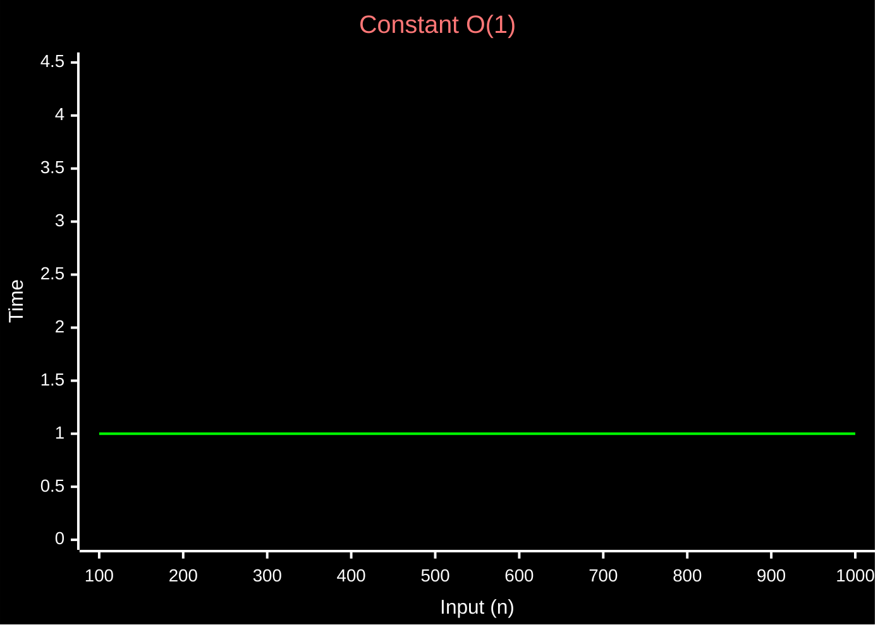

Algorithmic complexity
time complexity and space complexity

#Note 
Time complexity is a way to analyze an algorithm's efficiency by measuring how the number of operations grows as the input size increases (n).

three different notations
- BIG - O #Worst refers to the behavior of an algo in worst case scenario
- BIG - Ω #Best  (Omega) best case scenario
- BIG - Θ #Average  (Theta) average case scenario 

Common Complexities
- Linear - O(n)
- Constant - O(1)
- Quadratic - O(n2)
- Exponential - O(2n)
- Logarithmic - O(log n)

