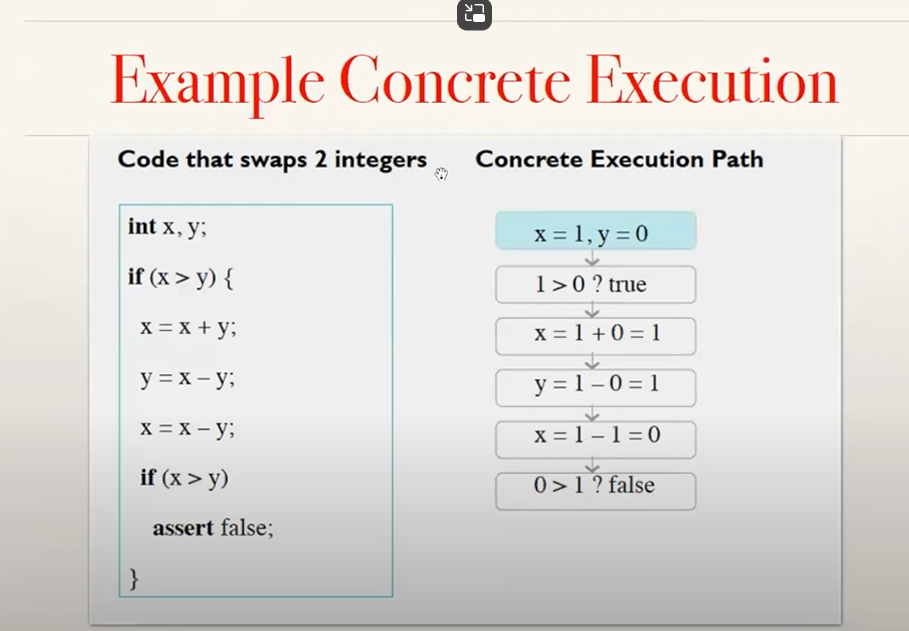
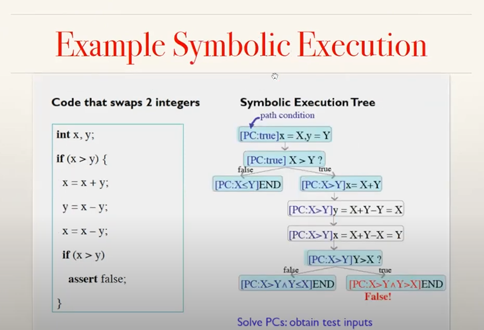

jpf extension that executes programs symbolically

Symbolic path finder which is a software analysis motivated by many bugs that exist in software and need for automated tools to find these bugs

## Approaches to finding errors

Testing - well accepted technique, may miss errors, well accepted technique

Model checking - automatic exhaustive, scalability issues, sophisticated

Static analysis - automatic scalable, reported errors may be spurious or false (although seeming to be genuine)

many approaches to find errors

### what spf is ?

spf is somewhat related to all these test it can generate test, built on top of model checker and it performs some what of a static analysis because it does symbolic evaluation which a lot of static analysis tools perform 

## symbolic execution

symbolic execution is a well known program analysis techniques out in 1970's which executes programs on symbolic rather than concrete inputs -- which represents multiple concrete inputs and then you can execute a program based on symbolical inputs that in some sense accounts to executing the program on multiple inputs at the same time 

### path conditions

analysis maintains so called path conditions that encodes conditions on inputs that follow the same program path these path conditions are basically collected from the different condition in code are check for satisfiability using [off-the-shelf solvers](Off-Shelf-Solvers.md)
if the path condition is found to be non satisfiable the analysis stops from that path because there are no inputs that can follow that path.
analysis only explores on feasible paths.
and the byproduct of this constraint solving is that the obtained solutions can be used a test inputs that exercise different paths through the code.

and there are many analyzers that perform this kin of symbolic execution there is one that puts a bound on the execution depth of account for loops and recursion

#### typical applications
test input generation test case generation error detection

tools SAGE, DART, KLEE

<h1 style="background: white; color: red">SPF - Symbolic Path Finder</h1>

## Example concrete execution

one trace one path through code

## Example Symbolic Execution

in contrast with symbolic execution we start with symbolic values
here Big X and BIG Y are symbolic values and the result of symbolic execution 
on these symbolic values is a set of traces rather than one trace and this set of traces can be organized in the so called symbolic execution tree