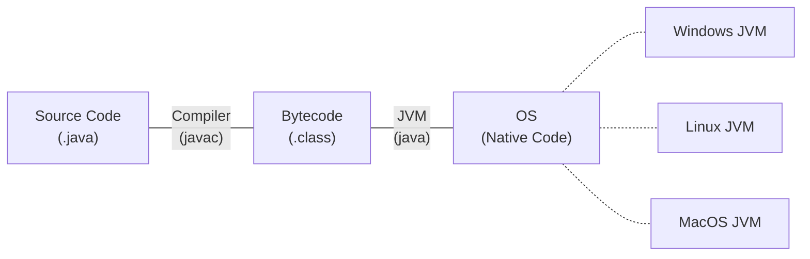
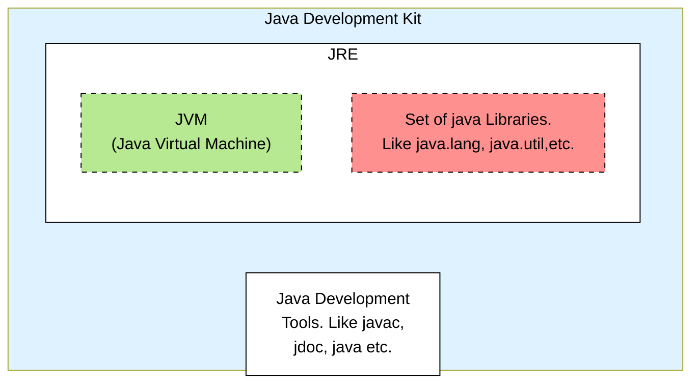
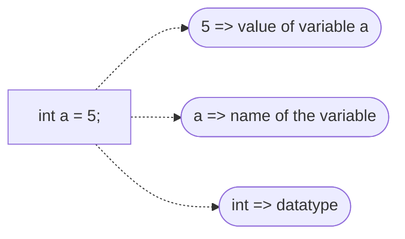
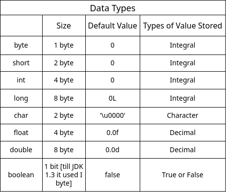
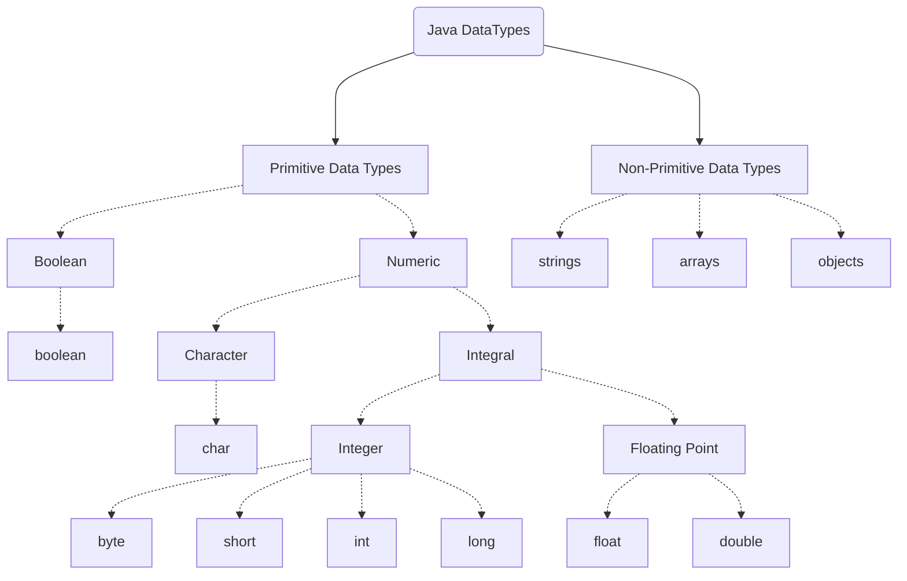
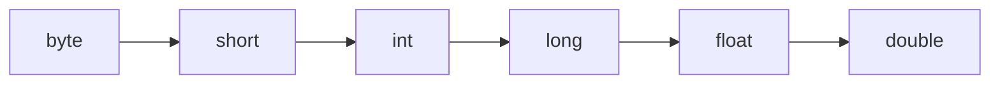
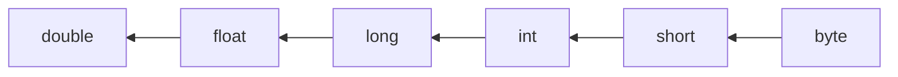

## History of Java ☕

- `James Gosling` , `Sun Microsystems`
- first release 1995
- previously called as `oak`
- named after java islands because of their coffee beans

## Features

- Java is *backward compatible*
- Java is *robust*
- Java is *oops* based
- Java is *multi threaded*
- Java is *distributed*
- **WORA**, platform independent (Write once run anywhere)
- Java uses compiler and interpreter both (jvm -> interpret or jit compiled)

## Buzzwords

1. `Bytecode` : a verified code that is not human readable made by converting source code using java compiler which will then convert to machine code by jvm.
2. `Robust` : means strong, hence java is robust strong exception handling, type checking, strong memory management.
3. `Multi-threaded` : means the ability to execuate a lot of threads concurrently of CPU.
4. `Distributed` : good in communicating with network protocols.
5. `JIT` : just in time compiler

## How does java source code gets converted to machine code?

Firstly the programmers writes the code on any text editor or IDE,
then java compiler compiles the code to byte code which is intermediate code
and is not human readable then the `JVM` converts the byte code to
machine code 0's and 1's.



## Files Extensions

`.java [sourcecode]` and `.class [bytecode]`

## JDK VS JVM VS JRE



`JDK` : it includes JRE, interpreter/loader (java), javac javadoc, and other tools needed for Java Development. Essentially, JDK is superset of JRE.
`JRE` : it is a part of JDK, but can be downloaded seprately. Provides libraries, the JVM, and other components to run application.
`JVM` : its a part of JRE and is responsible for executing the bytecode. "WORA" capability. Not platform independent.

## Print Statements

- `print("one")` : prints is one line, uses no new line
- `println("two")` : first prints then goes to a new line
- `println()` : will print a new line

For Example =>

```java
public class PrintStatement {
	public static void main(String[] args) {
		System.out.print("one");
		System.out.println();
		System.out.print("two");
		System.out.println("three");
		System.out.print("four");
	}
}
```

```bash
$ output
one
twothree
four
```

## Importance of the main method

- *Enrty point* : it's the entry point of a Java program, when the execution starts, JVM looks for main method.
- *public* and *static* : main method must be accessible to jvm without needing to instantiate the class.
- fix signature => public static void main(String[] args)

## What are variables?

- Variables are like containers used for storing data values.



- You can see here a variable `int a` has value `5`;
- It has integer datatype (will discuss about this later)
- For now integer has 4 bytes (32 bits) of size in java, so JVM will allocate 4 bytes for the variable a onto stack.
- Variable name does not gets stored onto the stack.
- There is a concept of address on the memory.

## Data Types



  In the table above you can see different different types of datatypes that are used in java.



In the above mermaid diagram you can have an overview of `Primitive` and `Non-Primitive` data types.

## Naming Conventions

### camelCase

- Start with a lowercase letter. Capitalize the first letter of each subsequent word.
- Example => `myVariableName`

### snake_case

- Start with an lowercase letter. Separate words with underscore.
- Example: `my_variable_name`

### kebab-case

- All lowercase letters. Separate words with hypens.
- Example : `my-variable-name`

Keep a good and short name, choose names that are descriptive but not too long. It should be make the variable's purpose understandable.

## Identifier Rules in Java

1. The only allowed characters for identifiers are all alphanumeric characters([A-Z], [a-z], [0-9]), '$' (dollar sign) and '_' (underscore).
2. Can't use keywords or reserve words.
3. Identifiers should not start with digits([0-9]).
4. Java identifiers are case-sensitive.
5. There is no limit on the length of the identifier but it is advisable to use an optimum length of 4 - 15 letters only.
6. Example =>


## Literals

- Integer literals => 10, 5, -8 etc ..
- Floating-point literals => 1.2, 0.25, -1.999, etc...
- Boolean literals => true, false
- Character literals => 'a', 'A', 'N', 'q', etc...
- String literals => "hi", "hello", "what's up?"
- Values that the varibales hold are called literals.

## Keywords

Here is a list of keywords in the Java programming language. You cannot use any of the following as identifiers in your programs. The keywords const and goto are reserved, even though they are not currently used. true, false, and null might seem like keywords, but they are actually literals; you cannot use them as identifiers in your programs.

| abstract  | continue | for        | new        | switch       |
| --------- | -------- | ---------- | ---------- | ------------ |
| assert*** | default  | goto*      | package    | synchronized |
| boolean   | do       | if         | private    | this         |
| break     | double   | implements | protected  | throw        |
| byte      | else     | import     | public     | throws       |
| case      | enum**** | instanceof | return     | transient    |
| catch     | extends  | int        | short      | try          |
| char      | final    | interface  | static     | void         |
| class     | finally  | long       | strictfp** | volatile     |
| const*    | float    | native     | super      | while        |

\* not used
\*\* added in 1.2
\*\*\* added in 1.4
\*\*\*\* added in 5.0

Go to this md for more information => [Keywords.md](Keywords.md)

## Escape Sequence

| Escape Sequence | Description                                                                                  |
| --------------- | -------------------------------------------------------------------------------------------- |
| `\t`            | Inserts a horizontal tab space in the string, typically equivalent to a few spaces.          |
| `\'`            | Inserts a single quote character in the text at this point.                                  |
| `\"`            | Includes a double quote character within a string enclosed by double quotes.                 |
| `\r`            | Inserts a carriage return in the text at this point.                                         |
| `\\`            | Represents a single backslash in the string.                                                 |
| `\n`            | Inserts a new line in the string, causing subsequent characters to be printed on a new line. |
| `\f`            | Inserts a form feed in the text at this point.                                               |
| `\b`            | Represents the backspace control character, moving the cursor one position backwards.        |

## User Input

- Scanner class
- Buffer reader
- Command line arguments
- Console class
- File reader
- Object Input Stream
- Properties
- Data Input Stream

  
Scanner class =>

| Method            |
| ----------------- |
| next( )           |
| nextLine( )       |
| nextInt( )        |
| nextDouble( )     |
| nextFloat( )      |
| nextLong( )       |
| nextByte( )       |
| nextShort( )      |
| nextBigInteger( ) |
| nextBigDecimal( ) |
| nextBoolean( )    |

## Type Conversion

Automatic Type Conversion
(Widening - Implicit - coercion)



Narrowing
(explicit - casting)



Some Examples =>

```java
// implicit
long big = 45;
float dec = 4;
double d = 3.4f;

// explicit
float eDec = (float) 3.4;
long eBig = (long) 3.4;
int eInt = (int) 3.4;
```

## Assignment operators

Assigns the right hand operand's value to the left hand operand

```java
//example
int a = 5;
int b = a;
```

- += => Addition and assign , x += 4; x = x + 4
- -= => Subtraction and assign , x -= 4; x = x - 4
- \*= => Multiplication and assign , x *= 4; x = x * 4
- /= =>  Division and assign , x /= 4; x = x / 4
- %= => Modulo and assign , x %= 4; x = x % 4

They are also called short hand operators. 👆

## Unary Operators

- - => unary minus , x = -y
- + => probably redundant
- ++ -- => post and pre
- ! => not for reversing boolean 

## Arithmetic Operators

| Operators | Meaning                                               | Example |
| --------- | ----------------------------------------------------- | ------- |
| +         | Addition                                              | x + y   |
| -         | Substraction                                          | x - y   |
| *         | Multiplication                                        | x * y   |
| /         | Division                                              | x / y   |
| %         | Modulus operator to get remainder in integer division | x % y   |

## Order of Operation

*`BODMAS OR PEMDAS`*


## If-else
- use if ( ) { } to check a condition
- if => execute block if condition is true, skips if false.
- else => execute a block when the condition is false.
- curly braces => can be omitted for single statements, but not recommended.
- if-else Ladder => multiple if and else if blocks, only one executes.
- Use variables: can store conditions in variables for use in if statements.

## Relational Operators
- Equality 
	- == checks value equality

- Inequality 
	- != checks value inequality

- Relational 
	- > Greater than
	- < Less than
	- <= Less than or equal to
	- >= Greater than or equal to

## Logical Operators

Types: && (AND), || (OR), ! (NOT)
- AND (&&): All conditions must be true for the result to be true.
- OR (||): Only one condition must be true for the result to be true.
- NOT (!): Inverts the Boolean value of a condition
